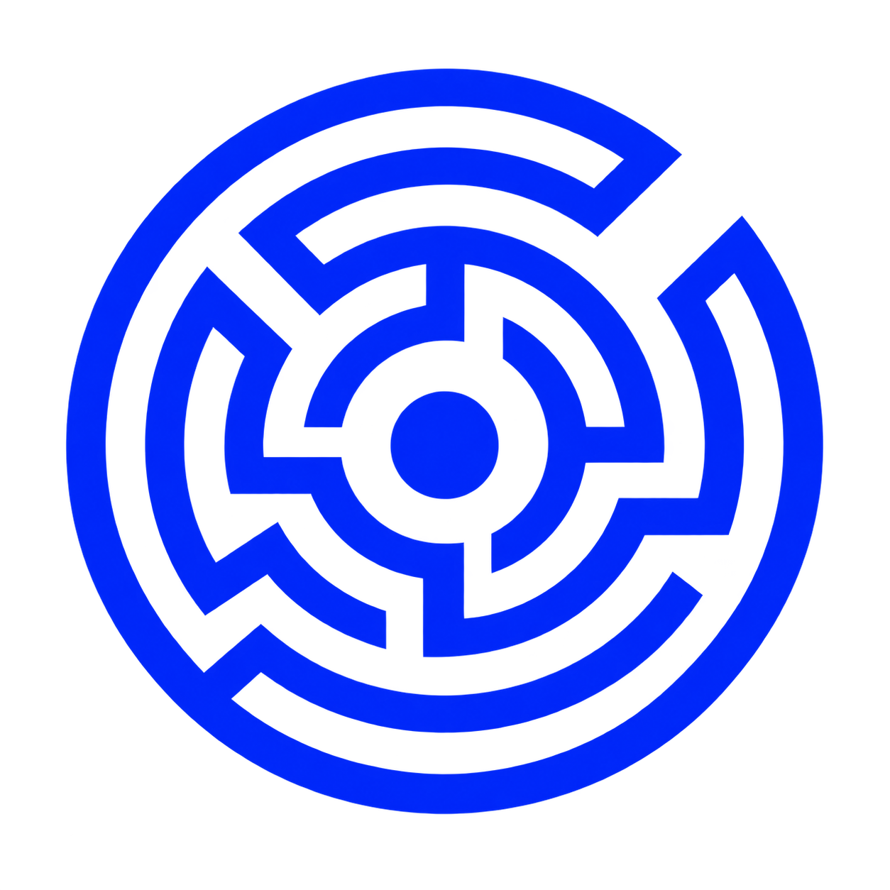
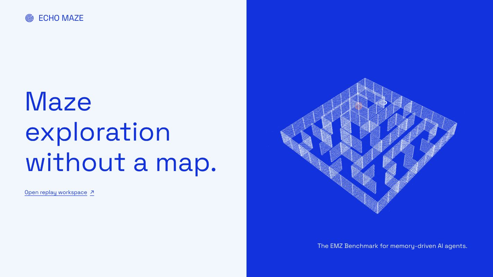
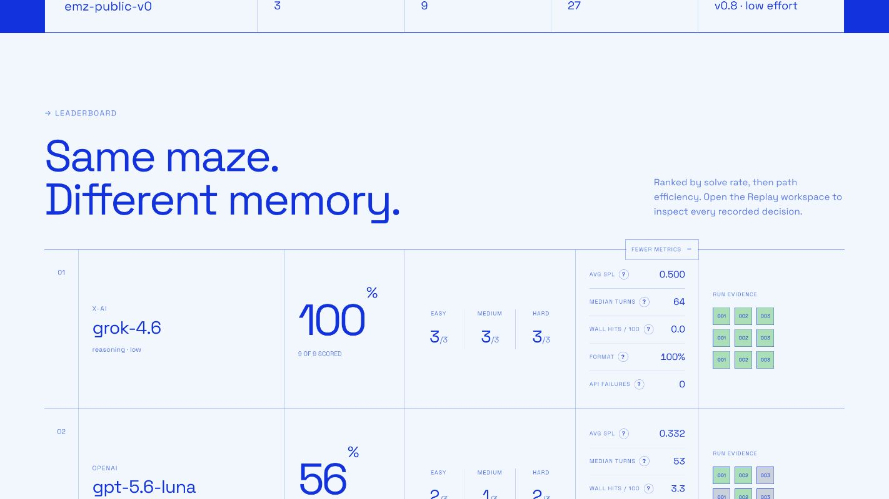
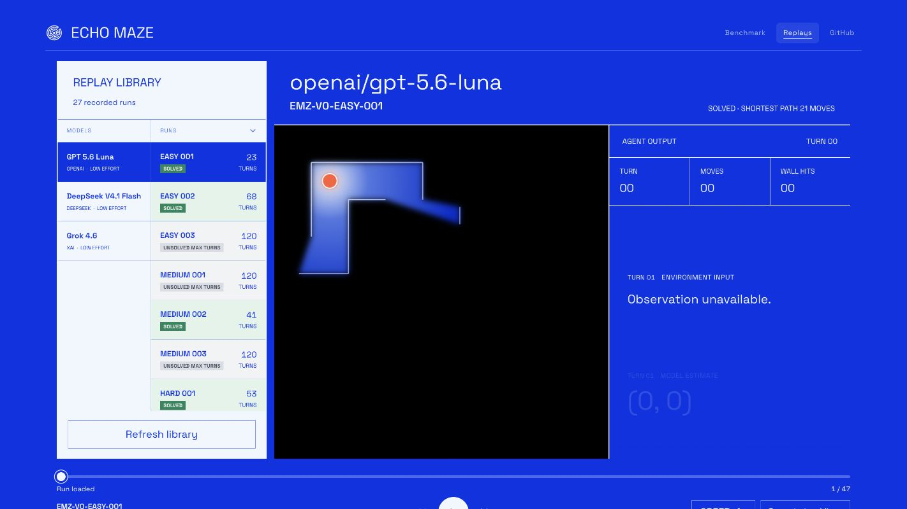

<p align="center">
  
</p>

<h1 align="center">Echo Maze</h1>

<p align="center"><strong>Where AI memory finds its way.</strong></p>

<p align="center">
  A replayable benchmark for AI agents navigating hidden mazes through observation and memory.
</p>

<p align="center">
  <a href="https://echo-maze.chih-han.workers.dev">Live site</a> ·
  <a href="https://echo-maze.chih-han.workers.dev/benchmark">Benchmark</a> ·
  <a href="https://echo-maze.chih-han.workers.dev/replay">Replays</a> ·
  <a href="./DEVELOPMENT.md">Development guide</a>
</p>



## Memory in Motion

Echo Maze asks a model to find an exit without receiving a map. The Walker can
only see along open corridors until a wall blocks its view. To escape, it must
interpret each observation, remember earlier turns, maintain its own relative
coordinates, and decide where to move next.

The **Echo Maze Benchmark (EMZ Benchmark)** turns that experience into a
comparable evaluation: models enter the same seeded maze suite under the same
rules, while every decision remains available as replayable evidence.

| Observe | Remember | Move |
| --- | --- | --- |
| See only the corridors visible from the current cell. | Carry spatial knowledge through the current conversation. | Choose one cardinal direction, then learn whether the move succeeded. |

## Compare models on the same maze suite



The public leaderboard currently compares each model across nine mazes: three
easy, three medium, and three hard. Rankings lead with solve rate and path
efficiency, while expanded metrics surface median turns, wall hits, output-format
reliability, and API failures. Every evidence square opens the corresponding run
in the replay workspace.

[Explore the live benchmark →](https://echo-maze.chih-han.workers.dev/benchmark)

## Replay every decision



The replay workspace puts the Walker's limited view beside its observable
response stream and movement history. Successful runs and failures are both
recorded, making it possible to inspect where a model remembered correctly,
became disoriented, recovered, or stopped producing valid actions.

[Open the replay workspace →](https://echo-maze.chih-han.workers.dev/replay)

## Evaluation contract

- Models receive corridor-based line of sight; walls hide everything behind them.
- The Walker starts its own coordinate system at `(0,0)` and updates it after successful moves.
- Memory is limited to the current run's conversation.
- The Walker receives no full map, absolute position, route-finding tool, or external notebook.
- The UI exposes concise response summaries, not hidden chain-of-thought.
- Seeded suites make model-to-model comparisons reproducible.
- Solved, max-turn, invalid-output, and API-failure runs are all retained.

## Repository map

| Path | Purpose |
| --- | --- |
| `app/` | Landing page, benchmark leaderboard, and replay interfaces |
| `lib/maze/` | Deterministic maze generation, movement, observation, and pathfinding |
| `benchmark/` | Model adapters, seeded batch runner, metrics, and replay publishing |
| `public/replay-data/` | Published run index and replay event data |
| `worker/` | Cloudflare Worker entrypoint |

## Run locally

Requires Node.js 22.13 or newer.

```bash
npm install
npm run dev
```

Before submitting a change:

```bash
npm run lint
npm test
```

For architecture, environment setup, benchmark commands, and deployment details,
see [DEVELOPMENT.md](./DEVELOPMENT.md).
